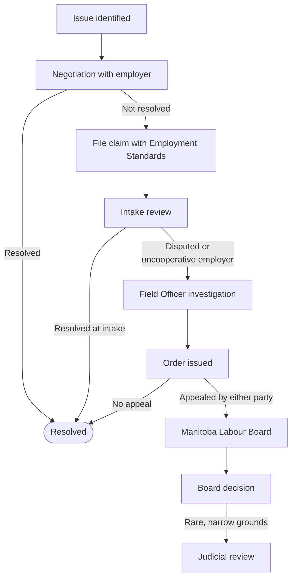

An Employment Standards claim isn't a single event. It's a process with
clearly defined stages. Knowing what each stage is for, and what's expected
of you in each one, removes a lot of the anxiety.

## The Five Stages

### 1. Negotiation

**Before** you file. You've identified that something is wrong (unpaid
wages, no severance, etc.) and you try to resolve it directly with your
employer or former employer.

A claim should be a last resort. Negotiation can include:

- A direct conversation
- A written request for what's owed
- A demand letter from a lawyer (often very effective)
- A back-and-forth on a severance offer

If you reach a fair agreement, document it in writing and you're done.
If the employer won't engage, won't pay, or is offering substantially less
than the code requires, the next stage starts.

### 2. File Your Claim

You submit your claim to the Manitoba Employment Standards Branch. This is
free, doesn't require a lawyer, and locks in the **6-month limitation period**
from the end of your employment.

You attach the documentation you have. You don't need to have everything
perfect, just file. You can supply more later. See
[How to file a claim](/claims/how-to-file/).

### 3. Intake

An **intake officer** is assigned and processes your claim. They will:

- Contact you to confirm and clarify your claim
- Contact your former employer for their side
- Ask follow-up questions and request additional documentation from both sides
- Make a **recommendation** if the facts are clear enough

A lot of claims resolve at the intake stage. Sometimes the employer pays
what's owed once contacted; sometimes the picture clarifies in a way that
ends the matter.

If the intake officer can't gather enough information from one of the
parties, typically because the employer is uncooperative or the facts are
genuinely disputed, the file moves to a field officer.

### 4. Field Officer

A **field officer** has more authority than an intake officer. Specifically:

- They can **legally compel** a party to provide records, including payroll,
  time records, and correspondence.
- They can issue a formal **judgement** (an order to pay).
- They can investigate more thoroughly.

The field officer's order is binding unless appealed.

### 5. Appeal

Either party, you or the employer, can **appeal** a field officer's order
to the **Manitoba Labour Board**. The Labour Board is a separate adjudicative
body that reviews the claim. Appeals are formal: there are filing windows,
written submissions, and often a hearing.

Most claims **don't** end up at the Labour Board. Of those that do, a lot
settle on the way. But it's the final venue within the Employment Standards
system.

After the Labour Board, the only further step is judicial review in court,
which is rare and a different kind of legal undertaking.

## What to Bring to Each Stage

| Stage | What's needed from you |
| --- | --- |
| Negotiation | Clear written record of the issue and what you're owed. |
| File | Identification, employment details, claim description, initial documents. |
| Intake | Responsiveness, the intake officer will ask for things; reply quickly. |
| Field Officer | More detailed records, witnesses if relevant, written timeline. |
| Appeal | Often legal advice or representation. Formal written submissions. |

## How Long It Takes

A long time, honestly. Be prepared for the full process, from filing to a
field officer judgement, to take **many months**, sometimes more than a
year. See [Expected timelines](/claims/timelines/).

## Next

- [Evidence and documentation](/claims/evidence-and-documentation/)
- [Expected timelines](/claims/timelines/)
- [Appeals and the Labour Board](/claims/appeals-and-labour-board/)
